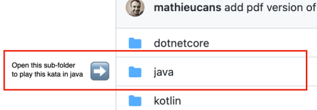

Shortcut aerobic
===
Simple exercises to learn shortcuts
--

You want to be more efficient in your everyday work? 
You know there are shortcuts, but you can never remember them?
Let's practice together and discover new tricks to program faster. 
Available languages: .net, java, kotlin, typescript.

Exercices are guided for InteliJ & Visual Studio Resharper, 
but nothing prevents you from doing them with your favorite IDE.
In each language, some tests invite you to manipulate code with shortcuts.

# Setup

Open with your IDE the directory of the langage you choose.

Start with koan basic an let yourself be guided.
Gradually, make the tests pass to green.

Have fun!

# References
- [learn IDE feature plugin](https://plugins.jetbrains.com/plugin/8554-ide-features-trainer) : a plugin to learn more shortcuts
- [force short cut plugin](https://plugins.jetbrains.com/plugin/8357-force-shortcuts) : a plugin that prevents you from using your mouse and offers you alternatives with shortcut
- [presentation assistant](https://plugins.jetbrains.com/plugin/7345-presentation-assistant) : a plugin that display the shortcut you've just used
- [Atelier maîtriser son IDE](https://github.com/sanlaville/master-your-ide) : another workshop by Rémy Sanlaville
